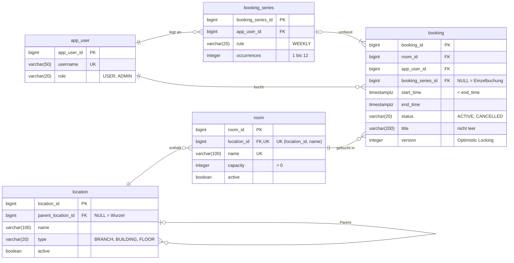

# RoomBook – Raumreservationssystem

HFTM Database Development Projektarbeit · Michael Gasser

Spring Boot und PostgreSQL. Die REST-API bucht Arbeits- und Meetingräume über mehrere Standorte hinweg,
schliesst Doppelbuchungen aus und wertet die Belegung aus.
Projektsteckbrief: [docs/management/Projectsketch_RoomBook.pdf](docs/management/Projectsketch_RoomBook.pdf)

## Fachliche Anforderungen

| Nr. | Anforderung                   |
|-----|-------------------------------|
| A1  | Standorthierarchie verwalten  |
| A2  | Räume verwalten               |
| A3  | Freie Räume suchen            |
| A4  | Buchung / Serienbuchung       |
| A5  | Buchung ändern / stornieren   |
| A6  | Buchungen einsehen            |
| A7  | Belegungsrate auswerten       |

## Datenmodell

Stand nach Migration V2 ([`db/migration`](src/main/resources/db/migration)).



Regeln, die zusätzlich in der Datenbank durchgesetzt werden (Nachweis: `SchemaConstraintsTest`):

- **Keine Doppelbuchung:** Exclusion Constraint `ex_booking_room_id` auf `(room_id, tstzrange(start_time, end_time))`
  für nicht stornierte Buchungen; direkt anschliessende Buchungen sind erlaubt (`[)`-Intervall).
- **Keine Zyklen in der Standorthierarchie:** Trigger `location_no_cycle` mit rekursiver Abfrage, parallele Umhängungen
  werden per Advisory Lock serialisiert.
- **Gültige Werte:** CHECK-Constraints für Enum-Werte, Kapazität, Zeitraum, Anzahl Serientermine und Titel.

Nicht in der Datenbank erzwungen: Dass eine Serie mindestens einen und höchstens `occurrences` Termine hat (im ERD
als 1..n dargestellt), stellt der Service sicher, indem er Serie und Termine in einer Transaktion anlegt (A4, T4).

Schemaentscheide:

- **Normalisierung (3NF):** Jede Information liegt an einer Stelle; Standortpfade werden nicht gespeichert, sondern
  per rekursiver Abfrage ermittelt, damit das Umhängen eines Knotens nur eine Zeile ändert.
- **Bewusste Redundanz:** `booking.app_user_id` ist bei Serienterminen gleich wie `booking_series.app_user_id`.
  Buchungen eines Benutzers (A6) lassen sich so ohne Umweg über die Serie filtern und indexieren.
- **Deaktivieren und Stornieren statt Löschen:** `active` bzw. `status`, damit Auswertungen (A7) die Historie behalten.
- **Enums als `varchar` mit CHECK** statt PostgreSQL-`ENUM`, weil neue Werte so per einfacher Migration ergänzt
  werden können.

## Voraussetzungen

- JDK 25
- Docker (für PostgreSQL via Docker Compose und Testcontainers)

## Start

```bash
./mvnw spring-boot:run     # startet PostgreSQL automatisch über compose.yaml
```

`spring-boot:run` aktiviert das Profil `dev` und lädt Beispieldaten aus
[`db/dev/R__dev_seed.sql`](src/main/resources/db/dev/R__dev_seed.sql); die Tests laden sie nicht.
Auf einer leeren DB gilt: `X-User-Id: 1` = admin (ADMIN), `2` = alice, `3` = bob (USER).

Swagger UI: http://localhost:8080/swagger-ui.html

## Tests

```bash
./mvnw verify              # Integrationstests gegen PostgreSQL (Testcontainers)
```

## Testdaten (T9)

```bash
docker compose exec -T postgres psql -U roombook -d roombook -v ON_ERROR_STOP=1 < scripts/generate-data.sql
```

[`scripts/generate-data.sql`](scripts/generate-data.sql) **ersetzt alle Daten** (auch den Dev-Seed) in der
migrierten DB, Laufzeit ca. 10 s. Deterministisch über `setseed`, zweimal ausgeführt mit identischer Prüfsumme
über alle Buchungen. Keine Personendaten (Benutzer `user1`…`user500`, Titel `Meeting`).

| Tabelle  | Anzahl  | Verteilung |
|----------|--------:|------------|
| app_user | 500     | `user1`–`user5` ADMIN; Buchungen pro Benutzer schief: min 148, Median 244, max 7'810 |
| location | 52      | 4 Standorte × 2 Gebäude × 5 Etagen |
| room     | 200     | 5 pro Etage, Kapazität 2–20; Belegung pro Raum schief: min 247, Median 714, max 2'049 Buchungen |
| booking  | 171'783 | 2025–2026, Mo–Fr 07–18 Uhr (Europe/Zurich), 30/45/60 min ab voller Stunde, davon 17'148 (10 %) storniert |

Überschneidungsfrei durch die Konstruktion: Jede Buchung liegt in einem eigenen Stunden-Slot ihres Raums.

## Nachweise

| Anforderung | Umsetzung | Nachweis |
|-------------|-----------|----------|
| A1          | `LocationController`/`LocationService`, Zyklen-Trigger `location_no_cycle` | `location/LocationApiTest`, `SchemaConstraintsTest` |
| A2          | `RoomController`/`RoomService`, `uq_room_location_id_name`, `ck_room_capacity` | `room/RoomApiTest`, `SchemaConstraintsTest` |
| A3          | `RoomRepository#findFree` (native SQL, rekursive CTE über aktive Standorte, `NOT EXISTS` mit `&&`) | `room/RoomSearchTest` |
| A4          | `BookingController`/`BookingService#create`, `ex_booking_room_id` | `booking/BookingApiTest` |
| A5          | `BookingService#update`/`#cancel`, `@Version` | `booking/BookingApiTest` |
| A6          | `BookingRepository#search` (JPQL-DTO-Projektion), `LocationRepository#findSubtreeIds` | `booking/BookingSearchTest` |
| A7          | `ReportService#occupancy` (JDBC), View `v_active_booking` (V3), `GET /api/reports/occupancy` | `report/ReportApiTest` |
| T4          | Serie und Termine in einer `@Transactional`-Methode, Flush pro Termin | `BookingConcurrencyTest#seriesIsRolledBackCompletelyWhenOneOccurrenceOverlaps` |
| T5          | Exclusion-Constraint (gleichzeitige Buchung), Optimistic Locking (gleichzeitige Änderung) → 409 | `BookingConcurrencyTest` (zwei Threads) |
| T6          | JPQL-DTO-Projektion für A6 (`BookingListItem`); parametrisierte JDBC-Auswertung mit JOIN und Aggregation über View `v_active_booking` für A7 | `booking/BookingSearchTest`, `report/ReportApiTest` |
| T7          | Filter, Sortierung `start_time, id` und `fetch first` in SQL, Seitengrösse max. 100 | `booking/BookingSearchTest`, `BookingQueryCountTest` (SQL enthält `fetch first`) |
| T9          | Generator `scripts/generate-data.sql` (siehe Testdaten) | Aufruf und Datensatzanzahlen oben |
| T10         | Index `idx_booking_app_user_id_start_time` (V4) für A6 nach Benutzer und Zeitraum | [`docs/performance`](docs/performance/README.md): Pläne und 10 Messungen vor/nach V4, Kosten; `scripts/measure-booking-search.sql` |
| T11         | Lazy-Beziehungen, A6 als DTO-Projektion statt Entities (siehe unten) | `booking/BookingQueryCountTest` |
| übrige T    | TODO      | TODO     |

**T11 – Abfragen für die Buchungsliste** (jede Buchung mit eigenem Raum und Benutzer, Seitengrösse 100):

| Treffer | Entities laden (vorher) | DTO-Projektion (nachher) |
|--------:|------------------------:|-------------------------:|
| 1       | 3                       | 1                        |
| 10      | 21                      | 1                        |
| 100     | 202                     | 2                        |

Beim Laden der Entities löst jeder Zugriff auf Raumname und Benutzername eine eigene Abfrage aus (N+1: 1 + 2n).
Die Liste braucht nur diese zwei Felder, deshalb liest die DTO-Projektion sie per JOIN in einer Abfrage. Die
zweite Abfrage bei 100 Treffern ist der Count für die Pagination; Spring Data lässt ihn weg, wenn die erste Seite
nicht voll ist.

## KI und Hilfsmittel

Eigenständigkeitserklärung, Hilfsmittelverzeichnis und Prompt-Verzeichnis: [docs/ki/KI-Deklaration.md](docs/ki/KI-Deklaration.md)
