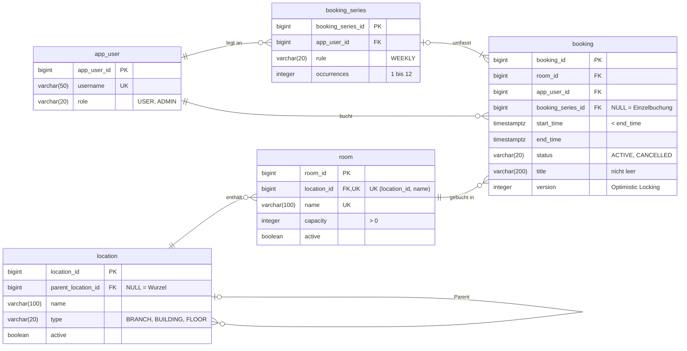

# RoomBook – Raumreservationssystem

HFTM Database Development Projektarbeit · Michael Gasser

Spring Boot und PostgreSQL. Die REST-API bucht Arbeits- und Meetingräume über mehrere Standorte hinweg,
schliesst Doppelbuchungen aus und wertet die Belegung aus.
Projektsteckbrief: [docs/management/Projectsketch_RoomBook.pdf](docs/management/Projectsketch_RoomBook.pdf)

## Fachliche Anforderungen

| Nr. | Anforderung                   |
|-----|-------------------------------|
| A1  | Standorthierarchie verwalten  |
| A2  | Räume verwalten               |
| A3  | Freie Räume suchen            |
| A4  | Buchung / Serienbuchung       |
| A5  | Buchung ändern / stornieren   |
| A6  | Buchungen einsehen            |
| A7  | Belegungsrate auswerten       |

## Datenmodell

Stand nach Migration V2 ([`db/migration`](src/main/resources/db/migration)).



Regeln, die zusätzlich in der Datenbank durchgesetzt werden (Nachweis: `SchemaConstraintsTest`):

- **Keine Doppelbuchung:** Exclusion Constraint `ex_booking_room_id` auf `(room_id, tstzrange(start_time, end_time))`
  für nicht stornierte Buchungen; direkt anschliessende Buchungen sind erlaubt (`[)`-Intervall).
- **Keine Zyklen in der Standorthierarchie:** Trigger `location_no_cycle` mit rekursiver Abfrage, parallele Umhängungen
  werden per Advisory Lock serialisiert.
- **Gültige Werte:** CHECK-Constraints für Enum-Werte, Kapazität, Zeitraum, Anzahl Serientermine und Titel.

Nicht in der Datenbank erzwungen: Dass eine Serie mindestens einen und höchstens `occurrences` Termine hat (im ERD
als 1..n dargestellt), stellt der Service sicher, indem er Serie und Termine in einer Transaktion anlegt (A4, T4).

Schemaentscheide:

- **Normalisierung (3NF):** Jede Information liegt an einer Stelle; Standortpfade werden nicht gespeichert, sondern
  per rekursiver Abfrage ermittelt, damit das Umhängen eines Knotens nur eine Zeile ändert.
- **Bewusste Redundanz:** `booking.app_user_id` ist bei Serienterminen gleich wie `booking_series.app_user_id`.
  Buchungen eines Benutzers (A6) lassen sich so ohne Umweg über die Serie filtern und indexieren.
- **Deaktivieren und Stornieren statt Löschen:** `active` bzw. `status`, damit Auswertungen (A7) die Historie behalten.
- **Enums als `varchar` mit CHECK** statt PostgreSQL-`ENUM`, weil neue Werte so per einfacher Migration ergänzt
  werden können.

## Voraussetzungen

- JDK 25
- Docker (für PostgreSQL via Docker Compose und Testcontainers)

## Start

```bash
./mvnw spring-boot:run     # startet PostgreSQL automatisch über compose.yaml
```

Swagger UI: http://localhost:8080/swagger-ui.html

## Tests

```bash
./mvnw verify              # Integrationstests gegen PostgreSQL (Testcontainers)
```

## Nachweise

| Anforderung | Umsetzung | Nachweis |
|-------------|-----------|----------|
| A1          | `LocationController`/`LocationService`, Zyklen-Trigger `location_no_cycle` | `location/LocationApiTest`, `SchemaConstraintsTest` |
| A2          | `RoomController`/`RoomService`, `uq_room_location_id_name`, `ck_room_capacity` | `room/RoomApiTest`, `SchemaConstraintsTest` |
| A3–A7       | TODO      | TODO     |
| T1–T12      | TODO      | TODO     |

## KI und Hilfsmittel

Eigenständigkeitserklärung, Hilfsmittelverzeichnis und Prompt-Verzeichnis: [docs/ki/KI-Deklaration.md](docs/ki/KI-Deklaration.md)
