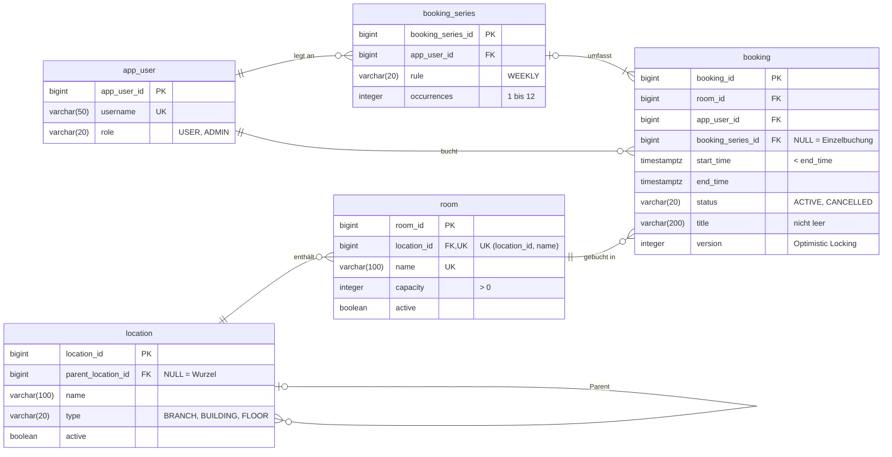

# RoomBook – Raumreservationssystem

HFTM Database Development Projektarbeit · Michael Gasser · Abgegebener Stand: Git-Tag `v1.0.0`

Spring Boot und PostgreSQL.<br>
Die REST-API bucht Arbeits- und Meetingräume über mehrere Standorte hinweg, schliesst Doppelbuchungen aus und wertet die Belegung aus.<br>
Projektsteckbrief: [docs/management/Projectsketch_RoomBook.pdf](docs/management/Projectsketch_RoomBook.pdf)

## Fachliche Anforderungen

| Nr. | Anforderung                   |
|-----|-------------------------------|
| A1  | Standorthierarchie verwalten  |
| A2  | Räume verwalten               |
| A3  | Freie Räume suchen            |
| A4  | Buchung / Serienbuchung       |
| A5  | Buchung ändern / stornieren   |
| A6  | Buchungen einsehen            |
| A7  | Belegungsrate auswerten       |

## Datenmodell

Stand nach Migration V2 ([`db/migration`](src/main/resources/db/migration)).



Regeln, die zusätzlich in der Datenbank durchgesetzt werden (Nachweis: `SchemaConstraintsTest`):

- **Keine Doppelbuchung:** Exclusion Constraint `ex_booking_room_id` auf `(room_id, tstzrange(start_time, end_time))`
  für nicht stornierte Buchungen; direkt anschliessende Buchungen sind erlaubt (`[)`-Intervall).
- **Keine Zyklen in der Standorthierarchie:** Trigger `location_no_cycle` mit rekursiver Abfrage, parallele Umhängungen
  werden per Advisory Lock serialisiert.
- **Gültige Werte:** CHECK-Constraints für Enum-Werte, Kapazität, Zeitraum, Anzahl Serientermine und Titel.

**Nicht in der Datenbank erzwungen:**<br>
- Dass eine Serie mindestens einen und höchstens 12 Termine (`occurrences`) hat (im ERD als 1..n dargestellt), stellt der Service sicher, 
indem er Serie und Termine in einer Transaktion anlegt (A4, T4).

**Schemaentscheide:**

- **Normalisierung (3NF):** Jede Information liegt an einer Stelle; Standortpfade werden nicht gespeichert, sondern
  per rekursiver Abfrage ermittelt, damit das Umhängen eines Knotens nur eine Zeile ändert.
- **Bewusste Redundanz:** `booking.app_user_id` ist bei Serienterminen gleich wie `booking_series.app_user_id`.
  Buchungen eines Benutzers (A6) lassen sich so ohne Umweg über die Serie filtern und indexieren.
- **Deaktivieren und Stornieren statt Löschen:** `active` bzw. `status`, damit Auswertungen (A7) die Historie behalten.
- **Enums als `varchar` mit CHECK** statt PostgreSQL-`ENUM`, weil neue Werte so per einfacher Migration ergänzt
  werden können.

## Voraussetzungen

- JDK 25
- Docker (für PostgreSQL via Docker Compose und Testcontainers)

## Start

```bash
./mvnw spring-boot:run     # startet PostgreSQL automatisch über compose.yaml
```

`spring-boot:run` aktiviert das Profil `dev` und lädt Beispieldaten aus
[`db/dev/R__dev_seed.sql`](src/main/resources/db/dev/R__dev_seed.sql).<br>
Die Tests laden sie nicht.<br>
Auf einer leeren DB gilt: `X-User-Id: 1` = admin (ADMIN), `2` = alice, `3` = bob (USER).

Swagger UI: http://localhost:8080/swagger-ui.html

API-Beispielaufrufe für A1–A7 inkl. Fehlerfällen: [`http/`](http) (IntelliJ HTTP Client, eine Datei pro Fachbereich).<br>
<br>
Die Umgebung wählt die Benutzer-IDs:<br>
- `dev` für den Dev-Seed auf leerer DB
- `testdata` nach dem Testdatengenerator (`1` = ADMIN, `6`/`7` = USER).<br>
 
Jede Datei legt ihre eigenen Standorte und Räume an und ist deshalb wiederholbar.<br>
Ohne JetBrains-IDE lassen sich dieselben Aufrufe über die Swagger UI ausführen (Header `X-User-Id` angeben).

## Tests

```bash
./mvnw verify              # Integrationstests gegen PostgreSQL (Testcontainers)
```

Voraussetzung: JDK 25 und ein laufendes Docker (z.B. Docker Desktop).<br>
Testcontainers startet `postgres:18`, Flyway baut das Schema ab leerer DB auf; `compose.yaml`<br>
Dev-Seed und T9-Testdaten werden nicht gebraucht. <br>
Jede Testklasse legt kleine, kontrollierte Daten an und entfernt sie wieder:<br>
per Rollback der Test-Transaktion bzw. explizit bei Tests, die echt committen müssen (`BookingConcurrencyTest`, `LocationSubtreeCacheTest`).

| Bereich | Testklassen |
|---------|-------------|
| DB-Regeln (gültige/ungültige Zustände) | `SchemaConstraintsTest` |
| Migrationen (Neuaufbau bei jedem Testlauf, V1 → V2 mit Bestandsdaten) | `RoomBookApplicationTests`, `SchemaMigrationTest` |
| API, Validierung, Berechtigungen (400/401/403/404/409) | `LocationApiTest`, `RoomApiTest`, `BookingApiTest` |
| Rollback und konkurrierende Änderungen | `BookingConcurrencyTest` |
| Abfrageergebnisse, Filter, Pagination, Auswertung | `RoomSearchTest`, `BookingSearchTest`, `ReportApiTest` |
| Ladeverhalten und Cache | `BookingQueryCountTest`, `LocationSubtreeCacheTest` |

## Testdaten (T9)

```bash
docker compose exec -T postgres psql -U roombook -d roombook -v ON_ERROR_STOP=1 < scripts/generate-data.sql
```

[`scripts/generate-data.sql`](scripts/generate-data.sql) **ersetzt alle Daten** (auch den Dev-Seed) in der
migrierten DB, Laufzeit ca. 10 s. Deterministisch über `setseed`, zweimal ausgeführt mit identischer Prüfsumme
über alle Buchungen. Keine Personendaten (Benutzer `user1`…`user500`, Titel `Meeting`).

| Tabelle  | Anzahl  | Verteilung |
|----------|--------:|------------|
| app_user | 500     | `user1`–`user5` ADMIN; Buchungen pro Benutzer schief: min 148, Median 244, max 7'810 |
| location | 52      | 4 Standorte × 2 Gebäude × 5 Etagen |
| room     | 200     | 5 pro Etage, Kapazität 2–20; Belegung pro Raum schief: min 247, Median 714, max 2'049 Buchungen |
| booking  | 171'783 | 2025–2026, Mo–Fr 07–18 Uhr (Europe/Zurich), 30/45/60 min ab voller Stunde, davon 17'148 (10 %) storniert |

Überschneidungsfrei durch die Konstruktion: Jede Buchung liegt in einem eigenen Stunden-Slot ihres Raums.

## Nachweise

| Anforderung | Umsetzung | Nachweis |
|-------------|-----------|----------|
| A1          | `LocationController`/`LocationService`, Zyklen-Trigger `location_no_cycle` | `location/LocationApiTest`, `SchemaConstraintsTest`, `http/locations.http` |
| A2          | `RoomController`/`RoomService`, `uq_room_location_id_name`, `ck_room_capacity` | `room/RoomApiTest`, `SchemaConstraintsTest`, `http/rooms.http` |
| A3          | `RoomRepository#findFree` (native SQL, rekursive CTE über aktive Standorte, `NOT EXISTS` mit `&&`) | `room/RoomSearchTest`, `http/rooms.http` |
| A4          | `BookingController`/`BookingService#create`, `ex_booking_room_id` | `booking/BookingApiTest`, `http/bookings.http` |
| A5          | `BookingService#update`/`#cancel`, `@Version` | `booking/BookingApiTest`, `http/bookings.http` |
| A6          | `BookingRepository#search` (JPQL-DTO-Projektion), `LocationRepository#findSubtreeIds` | `booking/BookingSearchTest`, `http/bookings.http` |
| A7          | `ReportService#occupancy` (JDBC), View `v_active_booking` (V3), `GET /api/reports/occupancy` | `report/ReportApiTest`, `http/reports.http` |
| T1          | 5 Tabellen, ERD und Schemaentscheide oben; CHECK, UNIQUE, FK, Exclusion-Constraint und Zyklen-Trigger in `V1__init.sql` | `SchemaConstraintsTest` |
| T2          | Flyway `V1`–`V4` unter `db/migration`, `ddl-auto: validate`; V2 ergänzt `booking.title` mit Backfill | `SchemaMigrationTest` (V1 → V2 mit Bestandsdaten), Neuaufbau ab leerer DB bei jedem Testlauf |
| T3          | JPA-Entities mit Beziehungen, Records als DTOs, Controller → Service → Repository, Deaktivieren/Stornieren statt Löschen | `http/*.http`, API-Tests |
| T4          | Serie und Termine in einer `@Transactional`-Methode, Flush pro Termin | `BookingConcurrencyTest#seriesIsRolledBackCompletelyWhenOneOccurrenceOverlaps` |
| T5          | Exclusion-Constraint (gleichzeitige Buchung), Optimistic Locking (gleichzeitige Änderung) → 409 | `BookingConcurrencyTest` (zwei Threads) |
| T6          | JPQL-DTO-Projektion für A6 (`BookingListItem`); parametrisierte JDBC-Auswertung mit JOIN und Aggregation über View `v_active_booking` für A7 | `booking/BookingSearchTest`, `report/ReportApiTest` |
| T7          | Filter, Sortierung `start_time, id` und `fetch first` in SQL, Seitengrösse max. 100 | `booking/BookingSearchTest`, `BookingQueryCountTest` (SQL enthält `fetch first`) |
| T8          | Integrationstests gegen PostgreSQL 18 (Testcontainers), kleine Testdaten pro Test | Abschnitt [Tests](#tests), `./mvnw verify` |
| T9          | Generator `scripts/generate-data.sql` (siehe Testdaten) | Aufruf und Datensatzanzahlen oben |
| T10         | Index `idx_booking_app_user_id_start_time` (V4) für A6 nach Benutzer und Zeitraum | [`docs/performance`](docs/performance/README.md): Pläne und 10 Messungen vor/nach V4, Kosten; `scripts/measure-booking-search.sql` |
| T11         | Lazy-Beziehungen, A6 als DTO-Projektion statt Entities (siehe unten) | `booking/BookingQueryCountTest` |
| T12         | `@Cacheable` auf `LocationService#findSubtreeIds` (Schlüssel = Standort-ID), Eviction nach Commit bei Anlegen/Umhängen (siehe unten) | `location/LocationSubtreeCacheTest` |

**T4 – Transaktion:** Eine Serienbuchung legt die Serie und bis zu 12 Termine in einer `@Transactional`-Methode an
und flusht jeden Termin einzeln. Kollidiert der n-te Termin, schlägt das Exclusion-Constraint beim Flush an und die
ganze Transaktion wird zurückgerollt: Die Serie und die bereits geschriebenen Termine bleiben nicht bestehen. Der
Test belegt das nach echten Schreibzugriffen, nicht nur nach einer Eingabeprüfung.

**T5 – Nebenläufigkeit:** Zwei Konflikte, zwei Strategien.
- *Gleichzeitige Buchung desselben Zeitraums:* Überschneidungen prüft nur das Exclusion-Constraint, bewusst ohne
  Vorabprüfung im Service. Eine Vorabprüfung würde zwei parallele Anfragen beide durchlassen; das Constraint lässt
  genau eine gewinnen, die andere erhält 409 mit dem Constraint-Namen.
- *Gleichzeitige Änderung derselben Buchung:* Optimistic Locking mit `@Version`. Der Client schickt die gelesene
  `version` mit, damit ein verlorenes Update auch über zwei getrennte HTTP-Anfragen erkannt wird → 409.

**T6/T7 – Abfragen:** Die Buchungsliste (A6) ist eine JPQL-DTO-Projektion: Sie liest nur die angezeigten Felder
inkl. Raum- und Benutzername per JOIN, filtert alle Kriterien in der DB, sortiert stabil nach `start_time, id` und
lädt nur die angeforderte Seite (`fetch first`, max. 100). Die Belegungsrate (A7) läuft über JDBC (`JdbcClient`,
parametrisiert) auf der View `v_active_booking`, weil sie `generate_series`, Schnitte von `tstzrange` und
Aggregationen braucht, die JPQL nicht ausdrücken kann. Gebuchte Stunden werden pro Raum aggregiert, bevor sie an die
Räume gejoint werden, damit mehrere Buchungen pro Raum den Nenner nicht vervielfachen. Freie Räume (A3) sind natives
SQL mit rekursiver CTE, weil JPQL keine Rekursion kennt.

**T11 – Abfragen für die Buchungsliste** (jede Buchung mit eigenem Raum und Benutzer, Seitengrösse 100):

| Treffer | Entities laden (vorher) | DTO-Projektion (nachher) |
|--------:|------------------------:|-------------------------:|
| 1       | 3                       | 1                        |
| 10      | 21                      | 1                        |
| 100     | 202                     | 2                        |

Beim Laden der Entities löst jeder Zugriff auf Raumname und Benutzername eine eigene Abfrage aus (N+1: 1 + 2n).
Die Liste braucht nur diese zwei Felder, deshalb liest die DTO-Projektion sie per JOIN in einer Abfrage. Die
zweite Abfrage bei 100 Treffern ist der Count für die Pagination; Spring Data lässt ihn weg, wenn die erste Seite
nicht voll ist.

**T12 – Cache für den Standort-Teilbaum:** Die Buchungsliste (A6) löst einen Standortfilter per rekursiver CTE in
die IDs des Teilbaums auf. Die Hierarchie ändert sich selten, deshalb wird die ID-Liste pro Standort-ID gecacht
(In-Memory, eine Instanz, keine TTL). Ein veralteter Teilbaum würde falsche Filterergebnisse liefern, deshalb gilt:
nach jeder committeten Änderung sofort aktuell. Anlegen und Umhängen leeren den ganzen Cache, weil sich die Teilbäume
aller Vorfahren ändern; geleert wird erst nach dem Commit, damit parallele Anfragen den alten Stand nicht wieder
cachen. Deaktivieren ändert die IDs nicht und behält den Cache. Der Test belegt erster Zugriff (Abfrage), Treffer
(keine Abfrage), Umhängen (neue Abfrage, aktueller Teilbaum bei altem und neuem Vorfahren), neuen Unterstandort,
Deaktivieren und Rollback. Details und Grenzen: `docs/PLAN.md`, Entscheid Phase 7.

## Einschränkungen

- **Authentifizierung gemockt:** Der Header `X-User-Id` bestimmt Benutzer und Rolle, ohne Login oder Token.
- **Belegungsrate (A7):** Feiertage werden ignoriert. Deaktivierte Räume zählen weiterhin mit, weil das Schema keinen
  Deaktivierungszeitpunkt kennt. Auswertungen nach Wochentag/Tageszeit und Stornoquote sind nicht umgesetzt.
- **Serien:** Nur wöchentlich, max. 12 Termine. Geändert und storniert wird pro Termin, nicht die Serie als Ganzes.
- **Zeitgenauigkeit:** Start und Ende werden auf volle Minuten abgeschnitten, ein gröberes Raster wird nicht erzwungen.
- **Cache (T12):** In-Memory für eine einzelne Instanz; Änderungen direkt in der DB sieht er erst nach einem Neustart.
- **Testdaten (T9):** Schiefe Verteilung nur bei Raumbeliebtheit und Buchungen pro Benutzer, ohne Stosszeiten und Serien.

## KI und Hilfsmittel

Eigenständigkeitserklärung, Hilfsmittelverzeichnis und Prompt-Verzeichnis: [docs/ki/KI-Deklaration.md](docs/ki/KI-Deklaration.md)
